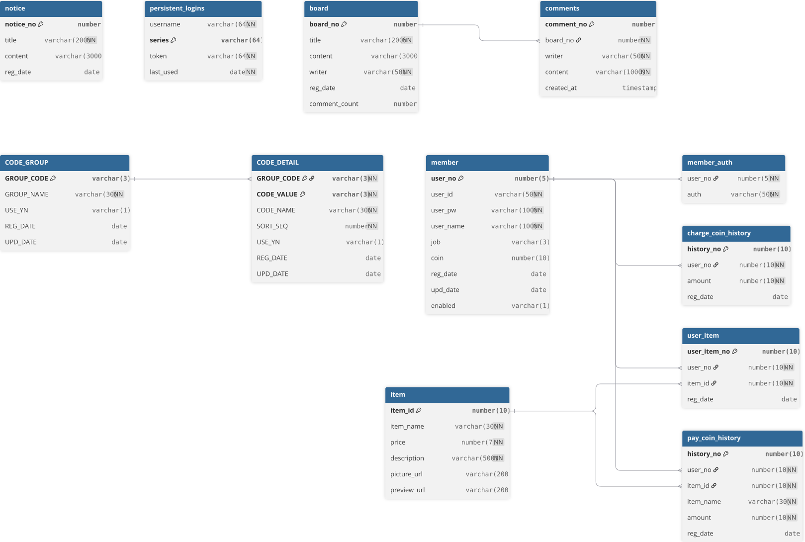
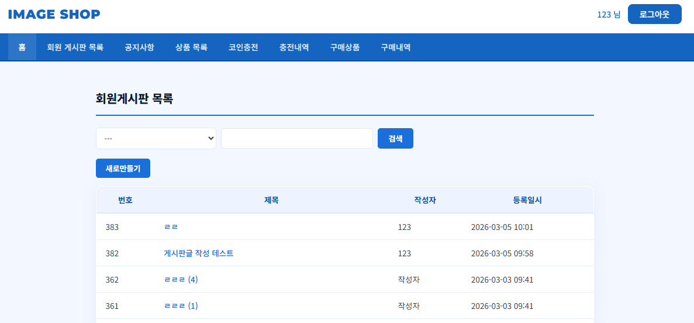
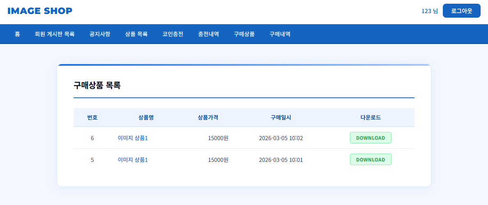
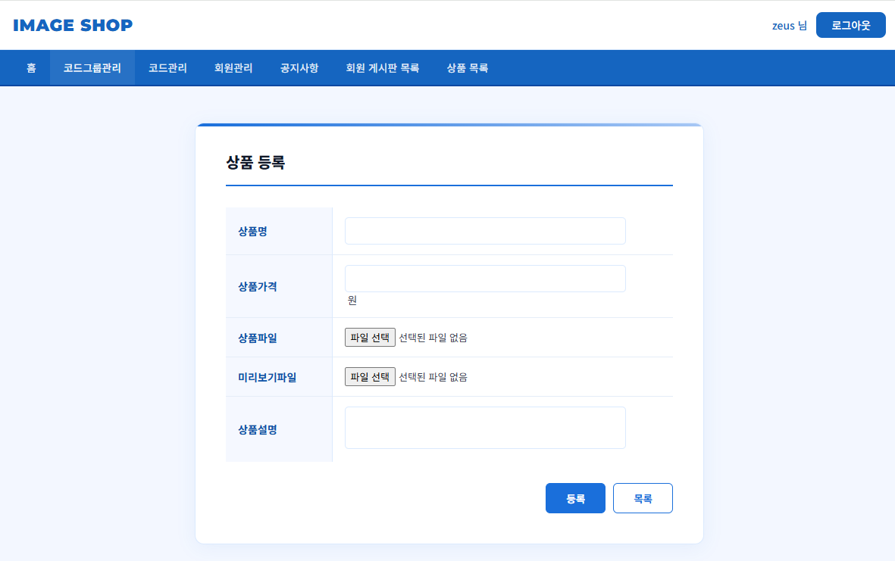

# 📌 이미지 샵

## 📝 프로젝트 소개
Java, jsp, MyBatis를 이용하여 구현한 **CRUD 기반 웹페이지**입니다.  
회원가입 시 일반 회원은 ROLE_MEMBER 권한을 부여받습니다.
서버와 db를 연결할 때 가장 처음 가입한 회원이 관리자 권한을 부여받도록 설정하였고
회원의 권한에 따라 다른 nav, 버튼을 보여주도록 설정했습니다.
게시판은 비회원 사용자도 볼 수 있습니다.
회원을 코인을 충전하여 관리자가 등록한 이미지 상품을 구매할 수 있으며
구매자는 구매한 상품을 다운로드할 수 있습니다.

---

## 🛠 개발 환경

| 구분 | 내용 |
|---|---|
| OS | Windows 11 Home |
| IDE | Eclipse STS 5.0.1.RELEASE |
| JDK | Java SE 17(zulu) |
| Language Level | Java 17 |
| Spring Boot | 4.0.3 |
| ORM / Mapper | MyBatis |
| Lombok | v1.18.42 |
| 형상관리 도구 | Git, GitHub |
| Database | OracleDB |

---

## ✨ 주요 기능

- 회원 가입 (기본 권한 `NORMAL_USER` 자동 부여)
- 로그인 / 로그아웃
- 회원 정보 조회
- 회원 정보 수정
- 회원 삭제 (Soft Delete)
- 권한(Role) 기반 페이지 분기 처리

- 자유게시판
- 공지사항
- 코인 충전
- 코인 충전 내역
- 상품 구매
- 상품 구매 내역
---

## 🔐 권한(Role) 정책

### ▶ 일반 회원
- 회원 가입 시 `ROLE_MEMBER` 권한 자동 부여
- 로그인 시 일반 사용자 페이지로 이동

### ▶ 관리자 계정
- 데이터베이스에 가장 처음 등록된 계정
- 보유 권한
  - `ADMIN`
---

## 🗄 데이터베이스 설계

## 📸 실행 화면

### 🏠 게시판 메인 화면

### 📋 이미지 구매 화면

### 👤 관리자가 상품을 추가하는 화면

